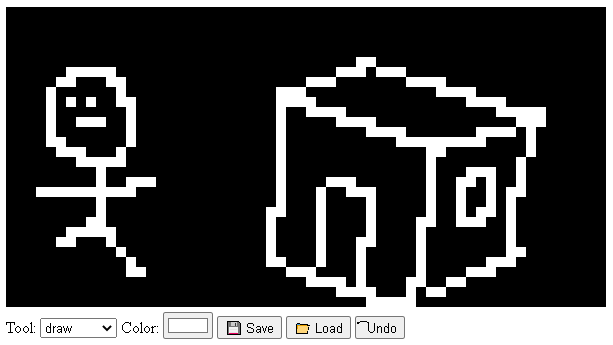

# Pixie

A pixel art editor purely built with vanilla JavaScript + canvas

## Features



- Tools:
  - Draw tool
  - Fill tool
  - Rectangle tool
  - Color picker
- Save drawn image
- Load image to editor (a bit wonky)
- Undo action

## Usage

Install webpack and webpack-dev-server

```sh
npm install
```

Run webpack server

```sh
npm run dev
```

## Electron

Run development build

```
npm run dev:electron
```

Build for current system

```
npm run pack
```

Build distributable for Mac, Windows and Linux

```
npm run dist
```

## References

Eloquent JavaScript: A Modern Introduction to Programming

## TODO

- Keyboard bindings: e.g bind undo to `CTRL+Z`
- Efficient drawing
- Improve image loading
- CSS

This project is [MIT](LICENSE) licensed.
