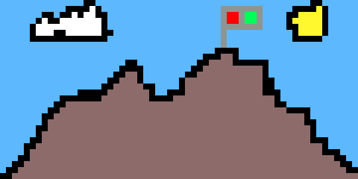
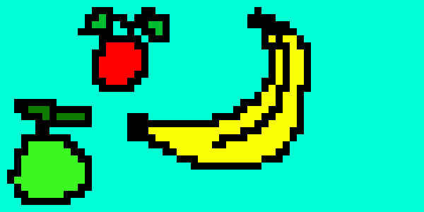
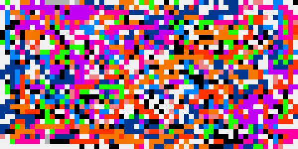

# [Pixie](https://pixie.collinsmuriuki.xyz)

A pixel art editor purely built with vanilla JavaScript + canvas







## Features

- Tools:
  - Draw tool
  - Fill tool
  - Shape tools: Rectangle, Circle and Triangle tools are supported
  - Color picker
- Save drawn image as png
- Load image to editor (a bit wonky)
- Undo/ Redo action with keybinds (`ctrl/cmd + "z"` and `ctrl/cmd + "y"` respectively)
- Save your pixel art with `ctrl/cmd + "s"` keybind support
- Local caching

## Local Development

Install dev dependencies

```sh
npm install
```

Run local server

```sh
npm run dev
```

## TODO

- Canvas resizing

This project is [MIT](LICENSE) licensed.
